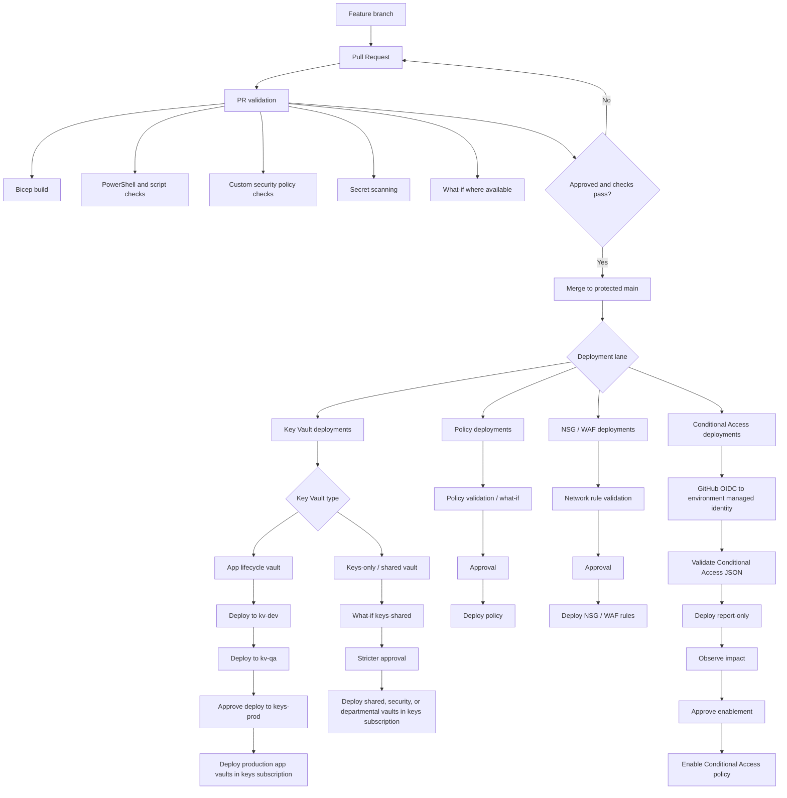

# Deployment Flows

This diagram shows the end-to-end flow from branch to deployment lane.

See `entra-managed-identity-conditional-access.md` for the detailed Conditional Access identity, token, trust, and upsert flows.

