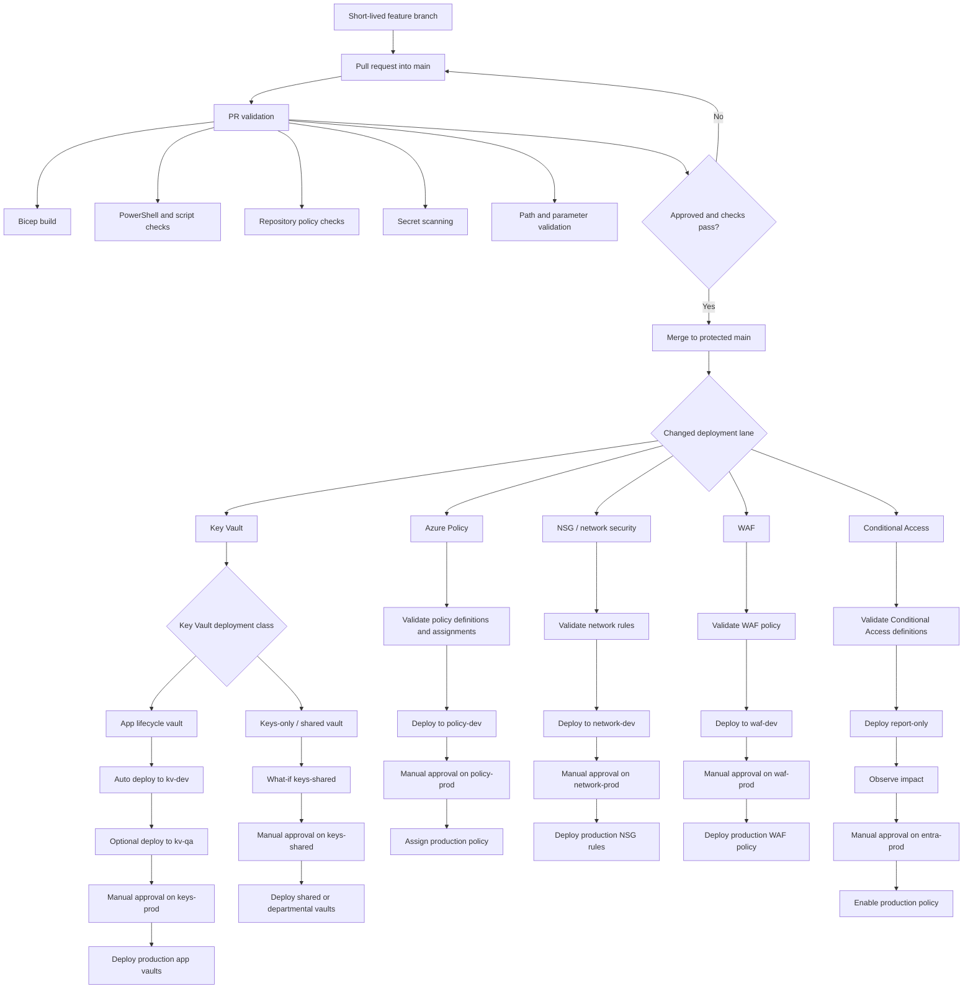

# Deployment Flows

This diagram shows how a reviewed commit moves from feature work into Bicep deployment lanes. Branches carry code review state; GitHub Environments carry Azure target, identity, and approval state.

