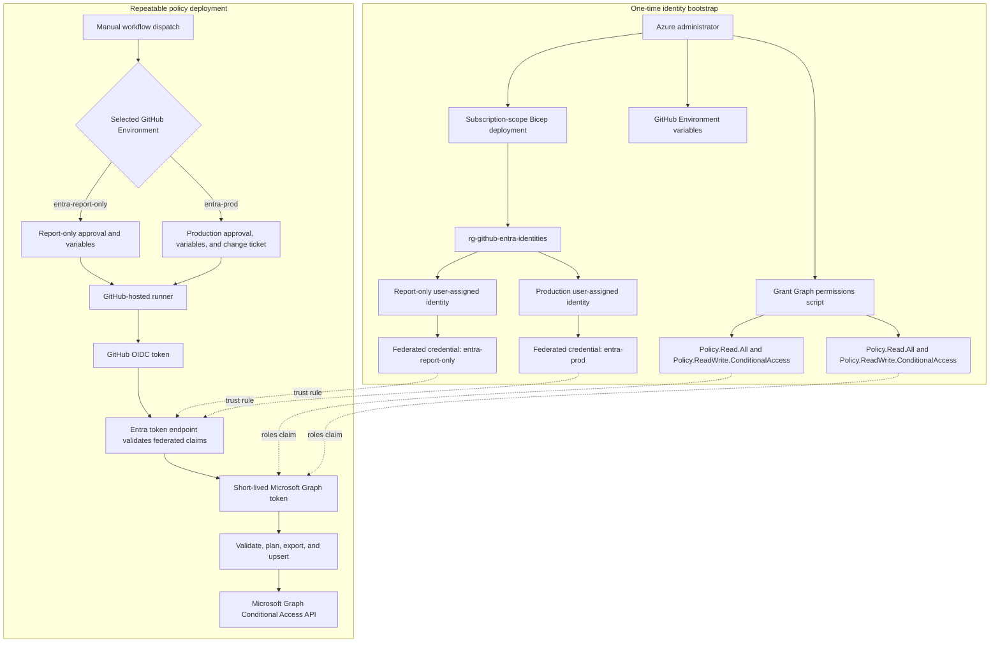
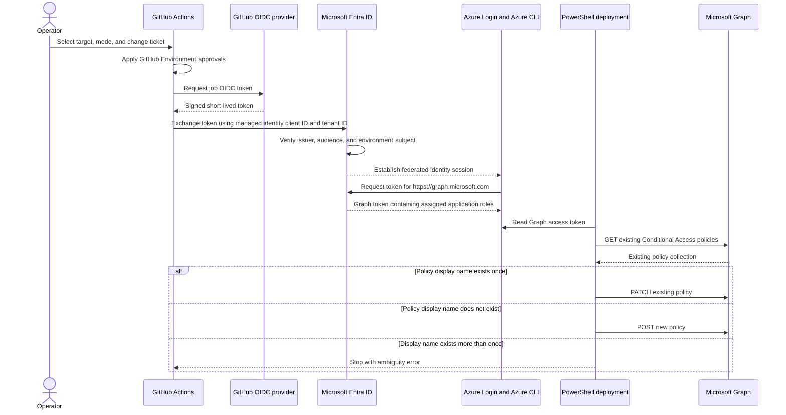
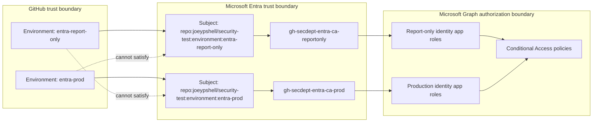
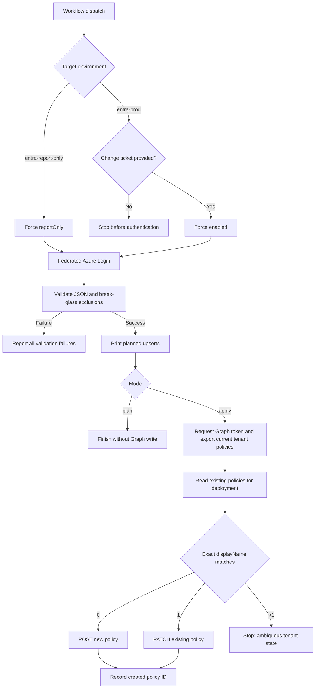
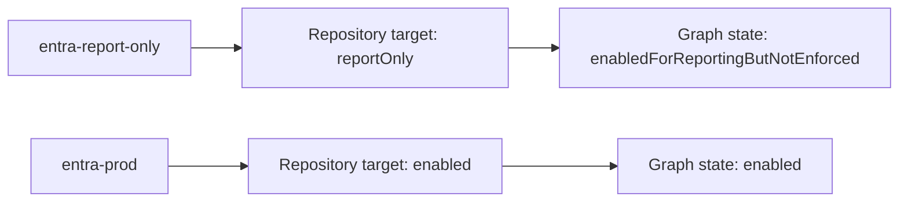

# Entra Managed Identity and Conditional Access Diagrams

These diagrams accompany the detailed [architecture guide](../architecture/entra-managed-identity-conditional-access.md).

## End-to-end architecture

The upper lane is one-time identity bootstrap. The lower lane is the repeatable Conditional Access deployment path.

## OIDC authentication sequence

The subscription hosts the managed identity but is not part of the tenant-scoped runtime token exchange.

## Environment and trust isolation

Each GitHub Environment has a distinct federated subject and managed identity.

## Policy deployment decision flow

## State translation

