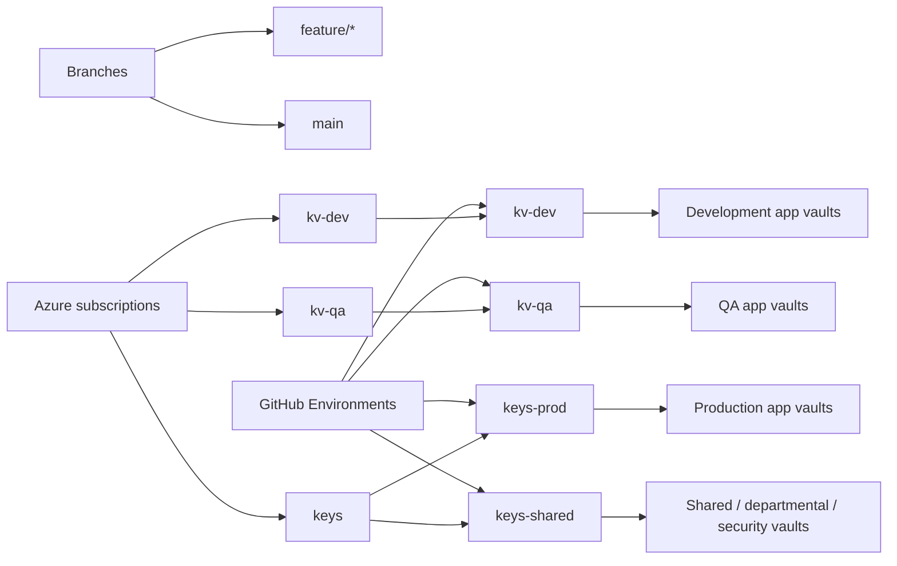

# Key Vault Target Map

This diagram shows why the `keys` subscription is split into two GitHub deployment targets.

```mermaid
flowchart LR
    A["Branches"] --> A1["feature/*"]
    A --> A2["main"]

    B["Azure subscriptions"] --> B1["kv-dev"]
    B --> B2["kv-qa"]
    B --> B3["keys"]

    C["GitHub Environments"] --> C1["kv-dev"]
    C --> C2["kv-qa"]
    C --> C3["keys-prod"]
    C --> C4["keys-shared"]

    B1 --> C1
    B2 --> C2
    B3 --> C3
    B3 --> C4

    C1 --> D["Development app vaults"]
    C2 --> E["QA app vaults"]
    C3 --> F["Production app vaults"]
    C4 --> G["Shared / departmental / security vaults"]
```
