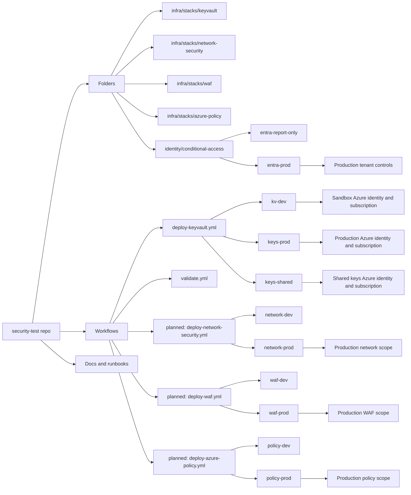

# Repository and Environment Model

This diagram separates code organization from deployment control. The repo stores the source of truth, workflows route changes by control area, and GitHub Environments hold Azure target configuration and approval gates.

## Design rule

Branches should not represent Azure environments. Use branches for review state and use GitHub Environments for deployment state.
